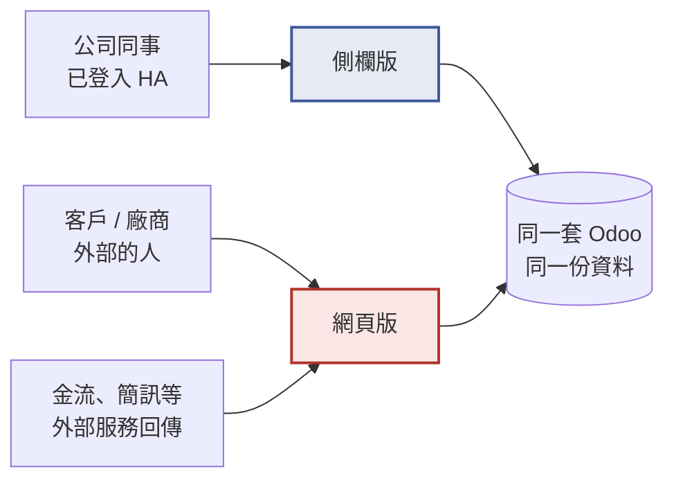

# Odoo 側欄版：專案概述與待辦

> [!IMPORTANT]
> **2026-09-24 現況說明：以下原文寫於 2026-09-08，主機、網址、版本等事實已過期。先讀這一段。**

## 〇、2026-09-24 現況

### 主機已退役

- 原文所指的正式機 **.189**（資料庫 `<.189 的正式資料庫>`、網址 `https://woowtech-odooo.woowtech.io`）上的 Odoo 已於 **2026-09-16 退役**（ADR 0003、#59）。網址已從 Cloudflare tunnel 與 DNS 移除；add-on 已停止並設為手動啟動，資料保留，退役前有備份 `pre-retire-odoo18ce-2026-09-16`。
- 目前所有驗證改在**測試機 .6**：資料庫 `odoo_test`，Public origin `https://woowtech-odoo-test-6.woowtech.io`，也是 parity 比對的對照組。主機位址不記錄在本 repo，向維運者取得。
- 會寫入資料的破壞性測試只准在測試機上跑（#59 P-8）。
- 附加元件從 0.3.38 升到 **0.4.3**。`main` 上還有尚未發版的變更（#126），之後的版本需要 Supervisor 2026.07.1 以上。
- `lan_networks` 預設值現在是 `192.168.0.0/16 10.0.0.0/8 172.16.0.0/12`。add-on 網段 `172.30.32.0/23` 一律不算內部網路，這就是 2026-09-08 曝險事件的修法。

因此第六節「交接資訊」的主機、網址、資料庫、版本都已不適用。原文中的 LAN 位址、網段與正式資料庫名稱已依本 repo 的慣例改為代稱。

### 各待辦的新狀態

剩下的工作由 Epic **#148** 追蹤，決定來自 2026-09-24 與維護者的釐清會議。

| 待辦 | 狀態 | 說明 |
|---|---|---|
| 區網直連 | ✅ 程式完成 | 區網與 tunnel 的分流、8072 由 nginx 接手、http 下的 cookie 都已處理（`DOCS.md`「LAN access」） |
| 1. 公網版受限 | ✅ 完成、已驗 | 0.4.3 起每次啟動都會自我檢查：資料庫管理頁若對 tunnel 開著，就發 HA 通知並停止容器（#79）。這就是原文說的「自動檢查防止再犯」 |
| 2. 對外網址鎖定 | ✅ 完成、已驗 | 已擴大到所有部署形態、所有資料庫（#57），新建資料庫的漏洞由 `woow_base_url_guard` 補上（#67），也同步 `website.domain`。2026-09-23 在 0.4.3 實測：admin 從側欄登入後值不變（#81） |
| 3. 外流連結、主控密碼 | ✅ 結案、不處理 | 外流的是 .189 的信件與連結。.189 已退役，維護者決定 .189 不再有任何後續：不輪替主控密碼、不盤點舊信件（#148） |
| 4. 側欄能力邊界 | ✅ 大致完成 | 2026-09-16/17 在 .6 測完（#60）。結論：擋住功能的不是 iframe 權限，而是用 **http** 開 HA 時頁面不是安全環境（secure context）。http 下剪貼簿、相機、Service Worker 都不存在，全螢幕可用；改用 HTTPS 開 HA 就正常。**「下載」（U-F5）還沒測**，由 #143 補 |
| 5. 修好複製鈕 | ✅ 完成、已驗 | 側欄注入的腳本在剪貼簿不存在時改用 `execCommand('copy')`（#60）。2026-09-23 實測顯示「Link copied!」。瀏覽器端組出的三種分享連結也改用正式網址且不帶 token（#70、#111） |
| 6. 只能走網頁版清單 | ✅ 文件完成 | 術語定為 **Structural gap**（`CONTEXT.md`）；給使用者看的清單在 `DOCS.md`「What only the Public origin can do」，含「相機／掃碼需要 HTTPS」（#140） |
| 7. 模組逐頁比對 | ⬜ 待測 | 範圍擴大為**實際安裝 29 個模組**：已裝的 13 個、計劃的 12 個加 `hr_timesheet`、綠界 4 個模組（取代「金流串接」）。在正式版 add-on 的新資料庫上，一律透過側欄 Apps 畫面安裝；共用層測一次（#143），每個模組用補完的 crawler 在兩個入口比對（#142、#144） |
| 8. 對外產出物 | 🟡 待測 | 伺服器端網址已鎖、瀏覽器端三種連結已修。郵件、報表 QR、附件、匯出檔、SEO、分享對話框由 #145 實測；綠界測試環境的真實付款、外部回呼與電子發票由 #146 實測 |
| 9. 修掉落差 | 🟡 依 7、8 | 已知落差 G-01 到 G-05 已處理（G-04 屬結構性限制）；#143–#146 找到的落差各開一個 issue |
| 10. 裝新模組前檢查 | ✅ 文件完成 | 路徑類由 add-on 自動處理（ADR 0005）；其餘寫成 `DOCS.md`「Generated rewrites」末尾的 *After installing an application* 清單（#140）。#144 每裝一個模組就照它驗一次 |
| 11. POS 設計決定 | ✅ 已決定 | ADR 0011：POS 兩個入口都能用；離線銷售是側欄的 Structural gap，由公網入口承接 |
| 12. 手機測試 | ⬜ 待測 | 手機畫面寬度的模擬併入 #143；HA 手機 App 與手機瀏覽器的實機測試是 #147（需要人） |

### 還卡在哪裡

- **App Store 同步從 2026-09-21 起失敗**（WOOWTECH/Woow_HA_App_Store#51），store 還停在 0.4.2，0.4.3 從沒送到主機上。
- 綠界電子發票模組需要 image 補上 `python3-pycryptodome`，隨 **0.4.4** 發布（#141）。
- 所以 #143–#146 的實測要等：store 同步修好 → 0.4.4 上架 → 測試機的正式版更新。

---

> 交接文件 · 2026-09-08 更新

把 Odoo 掛進 Home Assistant 側欄之後，有些原本在網頁版能做的事變得不能做了。這份文件說明現在的狀況、還缺什麼、接手的人該照什麼順序做。

| 機器 | Odoo 版本 | 資料庫 | 已裝功能 | 公網 |
|---|---|---|---|---|
| **woowtech** | **18 CE / 附加元件 0.3.38** | **&lt;.189 的正式資料庫&gt;** | **13 個模組** | **已開通・受限** |

## 一、這個專案在做什麼

同一套 Odoo，有兩個進入方式：

- **側欄版**——從 Home Assistant 左邊選單點進去，長在 HA 畫面裡面。好處是不用另外開網站、不用另外登入，也不會直接暴露在網路上。
- **網頁版**——用一般網址直接開 Odoo，跟一般網站一樣。

目標是：**網頁版能做到的每一件事，側欄版也要能做到**。目前有一部分做不到，這份文件就是要把它們找齊、補齊。

*兩個進入方式共用同一份資料。側欄版只有自己人能進；外面的人和外部服務只能走網頁版——這點很關鍵，後面很多待辦都跟它有關。*

## 二、現在的狀況

| 項目 | 狀態 |
|---|---|
| 側欄版 | ✅ 可以用 |
| 區網直連 | ✅ 已開通 |
| 公網版 | ✅ 已開通・受限 |
| 對外網址 | ✅ 已設對並鎖住 |
| 待辦剩餘 | 10 項 |

2026-09-08 一天之內解決了三件大事：**區網直連**、**公網版開通**、**對外網址設對並鎖住**。下面先講已解決的，再講剩下的。

> [!NOTE]
> **已解決一：系統現在知道自己對外的網址了**
>
> Odoo 有一個設定值記錄「我對外的網址是什麼」，所有要給別人的連結——分享連結、通知信、報表 QR——都照它產生。原本被設成只有機器自己看得到的位址（`127.0.0.1`），所以產出的連結寄給客戶都打不開。
>
> 現在已設成 **https://woowtech-odooo.woowtech.io**，並且**打開了「不要自動更改」的鎖**。以後不管誰從哪裡登入，這個值都不會再被蓋掉，內部通行碼也不會再被寫進寄出去的信裡。網站的網域欄位也一併補上了。

> [!NOTE]
> **已解決二：公網版開通了，而且外面看得到的東西是受限的**
>
> 從外面用 **https://woowtech-odooo.woowtech.io** 可以正常開登入頁了。同時實測確認：**資料庫管理、資料庫清單、XML-RPC 資料庫服務從外面一律打不開**，程式介面的資料庫指令也被擋。這些只有公司內部網路和 HA 側欄能用。
>
> 這代表對照組有了——待辦第 7、8 項的逐項比對現在可以開始做。

> [!CAUTION]
> **還沒解決：複製鈕按了沒反應**
>
> 你原本回報的「分享網址跟複製鈕不能用」是**兩件事**。網址錯誤那一半已經解決了（見上面）。
>
> 剩下的是複製鈕本身：側欄版是嵌在 HA 畫面裡的，瀏覽器對這種嵌在別人網頁裡的內容有安全限制，「寫入剪貼簿」預設被擋住，除非 HA 那邊主動開放。要先做待辦第 4 項測出來，才知道是「可以修」還是「得改用別的方式」。

## 三、待辦事項

照順序做。前面沒做完，後面做了也白做。

### 已完成 · 2026-09-08

- [x] **區網直連已開通並加上防護**
  - 公司兩個內部網段的電腦現在可以用 **&lt;.189 的 LAN 位址&gt;:8069** 直接開 Odoo，不必走 HA 側欄。內部電腦拿到完整功能（含資料庫管理員）；從外面來的一律擋掉。
  - 附加元件已更新到 **0.3.38**，實測：內部連線正常、外部連線全部被擋、HA 側欄不受影響。
  - 標籤：`已驗證` `0.3.38`
  - **順帶修掉：** 原本內部用 http 連進來時登入會一直彈回登入頁（cookie 設定問題），已修正。
  - **順帶補上：** 8072 這個埠原本永遠連不上，現在也通了。

- [x] **1. 公網版已開通，且外面看得到的東西是受限的**
  - 從外面用 **https://woowtech-odooo.woowtech.io** 可以開登入頁。實測確認資料庫管理、資料庫清單、XML-RPC 資料庫服務從外面一律打不開，程式介面的資料庫指令也被擋。
  - 標籤：`已驗證` `對照組已就緒`
  - **順帶解決：** 進入點原本會跳到資料庫選擇頁，現在直接進登入頁。

- [x] **2. 對外網址已設對並鎖住**
  - 設成 **https://woowtech-odooo.woowtech.io**，並打開「不要自動更改」的鎖。以後不管誰從哪裡登入都不會被蓋掉，內部通行碼也不會再被寫進寄出去的信裡。網站的網域欄位也一併補上。
  - 標籤：`已驗證` `解掉問題一`
  - **建議自行覆核：** 用管理員從側欄登入一次，再回設定確認網址沒被改掉。

### 接下來 · 先確認能力邊界

- [ ] **3. 檢查有沒有已經外流的連結，並決定要不要換密碼**
  - 過去寄出去的信、已經產生的分享連結，可能帶著錯誤網址或內部通行碼（對外網址是 2026-09-08 才修好的）。要盤點並判斷要不要重置。
  - **另外**：開通區網的過程中出過一次設定失誤，資料庫管理頁一度對外開著（詳見「要小心的地方」）。**當時的連線紀錄已經無法查回**，所以無法確認有沒有被外人碰過——要由你決定是否輪替資料庫主控密碼。
  - 標籤：`⛔ 需要你決定` `資安` `半天`
  - **做完的標準：** 盤點結果有紀錄；若確認外流，通行碼已重置。

### 第二批 · 弄清楚哪些是「能修的」哪些是「本來就做不到」

- [ ] **4. 測出側欄版到底被允許做哪些事**
  - 嵌在 HA 裡面的畫面，有些能力預設被瀏覽器擋住：複製到剪貼簿、全螢幕、開相機掃條碼、下載檔案。要先實測哪些是通的。
  - **這一項要最先做**——結果會直接決定後面一整批問題是「可以修」還是「本來就辦不到，只能走網頁版」，避免在做不到的事情上白花力氣。
  - 標籤：`⚠️ 關鍵分水嶺` `工程` `半天`
  - **做完的標準：** 產出一張清單，四項能力各自標明「可用 / 不可用」。

- [ ] **5. 修好複製鈕**
  - 依上一項的結果決定作法：若剪貼簿是通的，就查 Odoo 那邊為什麼沒觸發；若被擋住，就改成「點一下自動全選」讓人自己按 Ctrl+C。
  - 標籤：`工程` `依 4. 的結果` `1 天`
  - **做完的標準：** 側欄版按複製鈕，貼出來是正確的對外網址。

- [ ] **6. 把「只能走網頁版」的功能列成一張表**
  - 有些事側欄版原理上做不到，不是 bug。要明確列出來，並寫清楚這些功能改走網頁版，避免以後有人反覆回報同一件事。
  - 標籤：`文件` `需要你確認` `半天`
  - **做完的標準：** 清單完成並經確認，寫進專案文件。

### 第三批 · 逐項比對，把落差補齊

- [ ] **7. 兩邊開著，把 13 個模組逐頁走一遍**
  - 同一個畫面、同一筆資料，兩邊並排比：按鈕有沒有少、點下去結果一不一樣、畫面上出現的網址對不對。發現差異就記下來。
  - 重點放在共用的部分——列表、表單、欄位、對話框、附件、列印。這些是所有模組共用的底層，修一次就全部受益，不必每個模組重測一遍。
  - 標籤：`工程` `分批進行` `3–5 天`
  - **做完的標準：** 13 個模組都走過，落差清單有紀錄且分好輕重。

- [ ] **8. 特別檢查所有「會送到外面」的東西**
  - 寄出去的信、分享連結、報表上的 QR、客戶查詢頁的連結。這些一旦錯了就收不回來，是風險最高的一塊，值得單獨拉出來檢查。
  - 標籤：`⛔ 風險最高` `工程` `1 天`
  - **做完的標準：** 每一種對外產出物都實際產生一次，連結都用外部裝置點得開。

- [ ] **9. 把找到的落差逐項修掉**
  - 依第 7、8 項的清單，照嚴重度排序處理。修完要回頭重測。
  - 標籤：`工程` `視落差數量`
  - **做完的標準：** 清單上沒有未處理的嚴重項目。

### 第四批 · 之後要裝新功能之前

- [ ] **10. 裝新模組前先過一次檢查**
  - 每裝一個新模組，就可能帶進一批新的畫面路徑，側欄版不一定認得。要在裝的當下就檢查，不要等使用者回報。
  - 標籤：`流程` `持續`
  - **做完的標準：** 這道檢查被寫進安裝流程，不是靠人記得。

- [ ] **11. POS 要先做設計決定**
  - POS 的離線功能仰賴一項側欄版刻意關掉的瀏覽器機制，**在側欄版很可能完全無法離線**。這不是修得好的 bug，是要先決定：POS 只走網頁版，還是接受沒有離線。
  - 標籤：`⚠️ 裝之前先決定` `需要你決定`
  - **做完的標準：** 決定已拍板並記錄。

- [ ] **12. 手機測試另外排一輪**
  - 目前只測桌機瀏覽器。HA 手機 App 裡面是另一套環境，複製、下載、開新分頁的行為都不一樣，很多問題只會在手機上出現。
  - 標籤：`下一輪` `工程`
  - **做完的標準：** 手機 App 與手機瀏覽器各走一輪，結果另外記錄。

## 四、已經拍板的決定

接手的人不用重新討論這些事。

| 題目 | 決定 | 理由 |
|---|---|---|
| 分享連結該長什麼樣 | **一律用對外的正式網址** | 要能寄給客戶、能被外部裝置打開，也不會把內部通行碼帶出去 |
| 資料庫管理這類功能要不要也開給網頁版 | **不要，維持只有側欄版能用** | 刻意的安全設計，不算落差。測試時反而要確認它「還是關著的」 |
| 這一輪要測到哪 | **只測桌機瀏覽器** | 手機另外排一輪，本輪結論不能直接套用到手機 |
| 公網版要不要開 | **已開，且維持受限** | 2026-09-08 開通。外面只拿得到一般應用功能，資料庫管理仍只有內部與側欄能用 |
| 公司內部要怎麼連 | **區網直連 或 HA 側欄，兩者皆可** | 內部電腦 `<.189 的 LAN 位址>:8069` 有完整功能；側欄版適合已登入 HA 的人 |

## 五、要小心的地方

> [!NOTE]
> **管理員登入已經不會弄壞設定了**
>
> 原本每次管理員從側欄登入，對外網址都會被自動蓋掉一次。鎖已經打開，這個問題不會再發生，可以正常使用管理員帳號。

> [!CAUTION]
> **開通區網時踩過一次的坑，之後改設定要記得**
>
> 2026-09-08 開通區網的過程中，一度把「本機閘道位址」也算成內部網路。但對外通道剛好也是從同一個位址進來的，結果**資料庫管理頁對整個網際網路開著**。已在 0.3.38 修掉，並加了自動檢查防止再犯。
>
> **影響範圍無法確認。** 曝險大約落在 03:50–04:21（約 30 分鐘，比最初估的久）。當時的連線紀錄**已經無法查回**——每次更新都會換掉容器，舊紀錄一併消失，主機上也沒有另外留存。因此無法證明有沒有被外人碰過。
>
> 實際要動資料庫仍需主控密碼，且資料庫清單是關閉的，但**是否輪替主控密碼要由你決定**（待辦第 3 項）。
>
> 教訓：**「看起來像本機」不等於「來自內部」**。日後要放寬任何網路存取，改完一定要從公司外部實際連一次確認擋得住，不能只看設定檔。

> [!NOTE]
> **寄信功能現在可以正常用了**
>
> 信件裡的連結會用正式的對外網址產生，收件人點得開。但**在 2026-09-08 之前寄出去的信，裡面的連結是壞的**——見待辦第 3 項。

> [!NOTE]
> **「側欄版做不到」不一定是 bug**
>
> 外部的人、金流回傳、外嵌到別人網站的元件——這些本質上就到不了側欄版，因為外面沒有 HA 帳號。遇到這類回報，正確的處理是「改走網頁版」，不是想辦法修。

## 六、交接資訊

| 項目 | 內容 |
|---|---|
| 主機 | woowtech（可用既有的遠端連線設定登入） |
| Odoo 附加元件 | Odoo 18 CE，版本 **0.3.38**，狀態正常執行中 |
| 怎麼開 Odoo | **外部／客戶：** `https://woowtech-odooo.woowtech.io`（受限） **公司內部：** `http://<.189 的 LAN 位址>:8069`（完整功能） **或** 從 Home Assistant 左側選單進入 |
| 對外網址設定 | 已設為 `https://woowtech-odooo.woowtech.io` 並鎖住，網站網域欄位同步 |
| 內部網段設定 | 公司的兩個 /24 內部網段（`lan_networks`）；要調整在附加元件的選項頁改 |
| 使用中的資料庫 | &lt;.189 的正式資料庫&gt; |
| 已安裝的模組 | 會計、行事曆、聯絡人、客戶關係、人資、技能、訊息、行銷信、專案、待辦、採購、庫存、網站 |
| 計劃安裝的模組 | 銷售、線上商店、POS、金流串接、問卷、線上客服、活動、製造、請假、費用、出勤工時、招募 |
| 程式與詳細技術文件 | [GitHub · Woow_ha_odoo PR #40](https://github.com/WOOWTECH/Woow_ha_odoo/pull/40)（工程用的完整檢測計劃在裡面） |

> [!NOTE]
> **這份文件跟 PR #40 的關係**
>
> 這份是**給人看的概述與待辦**。PR #40 裡那份是**給工程執行用的完整檢測計劃**，包含 65 項逐條測試、判定標準與記錄格式。做到待辦第 7 項時再打開它。

---

Odoo 側欄版交接文件 · 2026-09-08（含當日區網開通後的更新）· 現況數據為實地查看所得。
